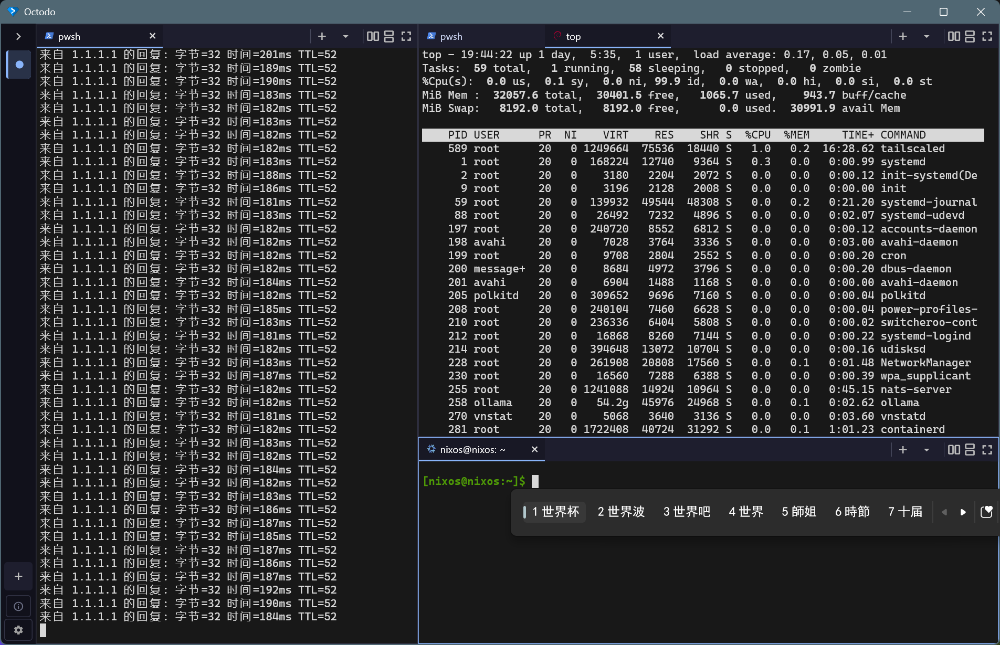

#  Octodo

**A Terminal Complex for CLI-Maxing Developers.**

A multi-workspace terminal complex built natively on Rust + Flutter for Windows and macOS. Not a bloated web wrapper, because RAM is too expensive, same as your time and attention.

English | [中文简体](./README.zh-CN.md)

[](https://github.com/invented-pro/octodo/releases/latest) [](./LICENSE) [](https://github.com/invented-pro/octodo/releases/latest)

---

## Overview

`Octodo` packs multi terminals right into a single window as workspace. Each workspace  runs its own shell sessions, tabs, and split panes—so you can pretend you know exactly what is happening in all of them at once. 



## Highlights

* **Rust-Fueled Speed:** Powered by the **Alacritty** GPU renderer. Sub-millisecond keystroke rendering, zero stutter.
* **Flutter-Native UI:** Fluid, multi-pane-tab layouts built natively for **Windows** and **macOS**. 
* **Keyboard First, Mouse Matters:** Driven by keyboard shortcuts, and also equipped with mouse **select-to-copy** and **right-click-to-paste** for when your left hand is busy holding coffee.
* **Auto-Discovery:** Instantly detects all available local shells and **WSL** distributions out of the box.
* **Multilingual Support:** Full **IME support** for seamless multi-language typing.
* **Self-Maintaining:** Silent, in-app **auto-upgrades** for both OS ecosystems. No manual fetching required.

## Platform Support

| #   | Platform              | Status        |
| --- | --------------------- | ------------- |
| 1   | Windows               | ✅             |
| 2   | macOS (Apple Silicon) | ✅             |
| 3   | Linux                 | ⏳ Coming Soon |

## Usage & Installation

The in-app updater adapts automatically: Microsoft Store and App Store builds update via their respective marketplaces. Direct-download builds self-apply the latest GitHub releases securely (Download → SHA-256 Verification → Hot Swap → Relaunch).

### Windows

#### Microsoft Store
Install directly from the [Microsoft Store](https://apps.microsoft.com/detail/9PJ4NR9XL3ZQ). Updates handle themselves automatically in the background.

#### Portable (.zip)
1. Download `octodo-v<version>-windows-x64.zip` from [Latest Releases](https://github.com/invented-pro/octodo/releases/latest).
2. Right-click the zip → **Properties** → check **Unblock** → Click **OK**. *(Crucial: This prevents Windows from blocking network and shell-spawn APIs).*
3. Extract anywhere and run `octodo.exe`.

### macOS (Apple Silicon)

#### Direct Download (.dmg)
1. Download `Octodo-v<version>-macos-arm64.dmg` from [Latest Releases](https://github.com/invented-pro/octodo/releases/latest).
2. Mount the DMG and drag `Octodo.app` into your **Applications** folder.
3. If Gatekeeper blocks execution on first launch, clear the quarantine attribute via terminal:
   ```bash
   xattr -dr com.apple.quarantine /Applications/Octodo.app
   ```

#### Mac App Store
*Coming soon.* Store builds will update automatically through the App Store ecosystem.

---

## Build From Source

### Prerequisites
* **Flutter SDK** (`>= 3.44.0`)
* **Rust Toolchain** (Installed via [rustup.rs](https://rustup.rs))
* **Platform Build Tools**: 
  * **Windows**: Windows 10/11 with Visual Studio (**Desktop development with C++** workload).
  * **macOS**: Xcode Command Line Tools.

### Compilation steps
```bash
git clone https://github.com/invented-pro/octodo.git
cd octodo
flutter pub get
flutter run -d windows    # For Windows hosts
# or
flutter run -d macos      # For macOS hosts
```
See [CONTRIBUTING.md](./CONTRIBUTING.md) for unit tests, lint policies, and our fork-patch workflow.

---

## Keyboard Shortcuts

### Workspaces (Sidebar)

| Windows              | macOS               | Action                                          |
| -------------------- | ------------------- | ----------------------------------------------- |
| `Ctrl+Shift+B`       | `Cmd+Shift+B`       | Toggle workspace drawer                         |
| `Ctrl+Shift+N`       | `Cmd+Shift+N`       | Create new workspace (auto-focus)               |
| `Ctrl+Shift+W`       | `Cmd+Shift+W`       | Close current workspace (requires confirmation) |
| `Ctrl+Shift+]`       | `Cmd+Shift+]`       | Next workspace (cyclic)                         |
| `Ctrl+Shift+[`       | `Cmd+Shift+[`       | Previous workspace (cyclic)                     |
| `Ctrl+Shift+1` … `9` | `Cmd+Shift+1` … `9` | Jump directly to workspace N                    |
| `F11`                | `Ctrl+Cmd+F`        | Toggle fullscreen mode                          |
| `Ctrl+Shift+Q`       | `Cmd+Shift+Q`       | Quit application                                |

### Panes (Splitting & Focus)

| Windows        | macOS         | Action                                 |
| -------------- | ------------- | -------------------------------------- |
| `Ctrl+Shift+D` | `Cmd+Shift+D` | Split focused pane vertically (Right)  |
| `Ctrl+Shift+E` | `Cmd+Shift+E` | Split focused pane horizontally (Down) |
| `Ctrl+Shift+↑` | `Cmd+Shift+↑` | Move focus to pane above               |
| `Ctrl+Shift+↓` | `Cmd+Shift+↓` | Move focus to pane below               |
| `Ctrl+Shift+←` | `Cmd+Shift+←` | Move focus to pane on the left         |
| `Ctrl+Shift+→` | `Cmd+Shift+→` | Move focus to pane on the right        |
| `Ctrl+Shift+M` | `Cmd+Shift+M` | Maximize / Restore focused pane        |

### Tabs (Inside Focus Pane)

| Windows          | macOS          | Action                       |
| ---------------- | -------------- | ---------------------------- |
| `Ctrl+Shift+T`   | `Cmd+Shift+T`  | Open new tab in focused pane |
| `Ctrl+Shift+K`   | `Cmd+Shift+K`  | Close active tab             |
| `Ctrl+Tab`       | `Cmd+Option+→` | Cycle to next tab            |
| `Ctrl+Shift+Tab` | `Cmd+Option+←` | Cycle to previous tab        |
| `Ctrl+1` … `9`   | `Cmd+1` … `9`  | Jump directly to tab N       |

### Terminal Engine (Clipboard & Zoom)

| Windows                        | macOS                        | Action                      |
| ------------------------------ | ---------------------------- | --------------------------- |
| `Ctrl+Shift+C` / `Ctrl+Insert` | `Cmd+Shift+C` / `Cmd+Insert` | Copy active selection       |
| `Ctrl+V` / `Ctrl+Shift+V`      | `Cmd+V` / `Cmd+Shift+V`      | Paste from clipboard        |
| `Shift+Insert`                 | `Shift+Insert`               | Alternative paste           |
| `PageUp` / `PageDown`          | `PageUp` / `PageDown`        | Scroll view by single page  |
| `Ctrl+=`                       | `Cmd+=`                      | Increase font scale         |
| `Ctrl+-`                       | `Cmd+-`                      | Decrease font scale         |
| `Ctrl+0`                       | `Cmd+0`                      | Reset font scale to default |

---

## Acknowledgments

Sincere thanks to the [Alacritty](https://github.com/alacritty/alacritty) team for creating such a lightweight, fast, and elegant masterpiece to power our terminal emulation and hardware-accelerated rendering (licensed under MPL-2.0).

## License

Released under the **MIT License**. See [`LICENSE`](./LICENSE) for the full text.
