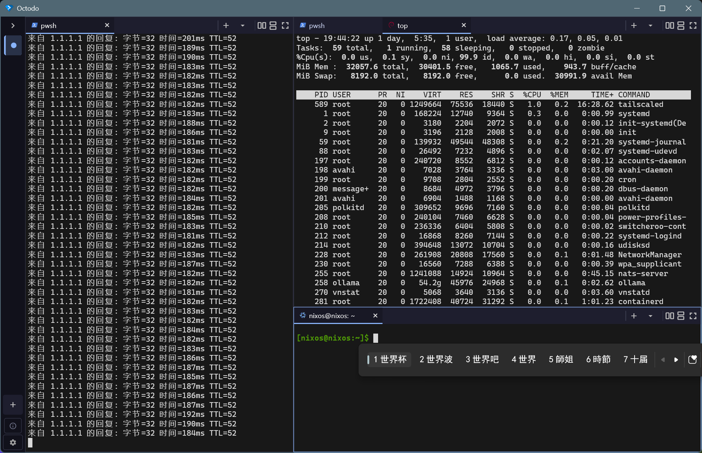

#  Octodo

一个多工作区终端复合体，基于 Flutter + Rust 构建，面向 Windows。

[English](./README.md) | 简体中文

---

## 简介

`Octodo` 是一个桌面终端「复合体」— 单个窗口承载多个工作区，
每个工作区拥有自己的 shell 会话、分屏和标签。  

## 功能

- **GPU 渲染终端，由 Alacritty 这一基于 Rust 的渲染器驱动。**
- **Flutter 原生多窗格 / 标签布局。**
- **键盘快捷键驱动。**
- **IME 支持。**
- **按主机自动检测可用的 shell。**

## 平台支持

| # | 平台 | 状态 |
| --- | --- | --- |
| 1 | Windows | ✅ |
| 2 | macOS | ❌ |
| 3 | Linux | ❌ |

## 使用方法

1. 从 [Releases](https://github.com/invented-pro/octodo/releases/latest)
   下载最新的 `octodo-windows.zip`。
2. 解压前，右键 zip 文件 → **属性** → 勾选 **解除锁定** → **确定**。
   这一步避免 Windows 将解压后的 `.exe` 标记为「不信任」，进而
   拦截网络访问与 shell 启动相关的 API。
3. 解压到任意目录，双击 `octodo.exe` 即可启动。

如需从源码构建，请参阅下文。

### 从源码构建

需要 Flutter SDK（>= 3.44.0）、Rust 工具链（通过
[rustup](https://rustup.rs/) 安装）以及 Windows 10/11 上的
**Desktop development with C++** Visual Studio 工作负载：

    git clone https://github.com/invented-pro/octodo.git
    cd octodo
    flutter pub get
    flutter run -d windows

请见 [CONTRIBUTING.md](./CONTRIBUTING.md) 了解测试、lint 与
fork 补丁工作流。

## 键盘快捷键

### 工作区（侧边栏）

| Windows / Linux       | macOS                | 动作                               |
|-----------------------|----------------------|------------------------------------|
| `Ctrl+Shift+B`        | `Cmd+Shift+B`        | 切换工作区抽屉                     |
| `Ctrl+Shift+N`        | `Cmd+Shift+N`        | 新建工作区（自动聚焦终端）           |
| `Ctrl+Shift+W`        | `Cmd+Shift+W`        | 关闭当前工作区（弹窗确认）           |
| `Ctrl+Shift+]`        | `Cmd+Shift+]`        | 下一个工作区（循环）                 |
| `Ctrl+Shift+[`        | `Cmd+Shift+[`        | 上一个工作区（循环）                 |
| `Ctrl+Shift+1` … `9`  | `Cmd+Shift+1` … `9`  | 跳转到第 N 个工作区                 |
| `F11`                 | `Ctrl+Cmd+F`         | 切换全屏                           |
| `Ctrl+Shift+Q`        | `Cmd+Shift+Q`        | 退出                               |

### 窗格（分屏 + 焦点切换）

| Windows / Linux       | macOS                | 动作                               |
|-----------------------|----------------------|------------------------------------|
| `Ctrl+Shift+D`        | `Cmd+Shift+D`        | 右侧分屏                           |
| `Ctrl+Shift+E`        | `Cmd+Shift+E`        | 下方分屏                           |
| `Ctrl+Shift+↑`        | `Cmd+Shift+↑`        | 焦点切到上方的窗格                 |
| `Ctrl+Shift+↓`        | `Cmd+Shift+↓`        | 焦点切到下方的窗格                 |
| `Ctrl+Shift+←`        | `Cmd+Shift+←`        | 焦点切到左侧的窗格                 |
| `Ctrl+Shift+→`        | `Cmd+Shift+→`        | 焦点切到右侧的窗格                 |
| `Ctrl+Shift+M`        | `Cmd+Shift+M`        | 切换聚焦窗格的最大化               |

### 标签（窗格内）

| Windows / Linux       | macOS                | 动作                               |
|-----------------------|----------------------|------------------------------------|
| `Ctrl+Shift+T`        | `Cmd+Shift+T`        | 在聚焦窗格新建标签                 |
| `Ctrl+Shift+K`        | `Cmd+Shift+K`        | 关闭聚焦标签                       |
| `Ctrl+Tab`            | `Cmd+Option+→`       | 聚焦窗格的下一个标签（循环）       |
| `Ctrl+Shift+Tab`      | `Cmd+Option+←`       | 聚焦窗格的上一个标签               |
| `Ctrl+1` … `9`        | `Cmd+1` … `9`        | 跳转到第 N 个标签                  |

### 终端引擎（剪贴板 / 滚动）

| Windows / Linux       | macOS                | 动作                               |
|-----------------------|----------------------|------------------------------------|
| `Ctrl+Shift+C`        | `Cmd+Shift+C`        | 复制选区                           |
| `Ctrl+Insert`         | `Cmd+Insert`         | 复制选区（备选）                   |
| `Ctrl+V`              | `Cmd+V`              | 粘贴                               |
| `Ctrl+Shift+V`        | `Cmd+Shift+V`        | 粘贴                               |
| `Shift+Insert`        | `Shift+Insert`       | 粘贴                               |
| `PageUp` / `PageDown` | `PageUp` / `PageDown`| 上下翻页                           |
| `Ctrl+=`              | `Cmd+=`              | 放大字体                           |
| `Ctrl+-`              | `Cmd+-`              | 缩小字体                           |
| `Ctrl+0`              | `Cmd+0`              | 重置字体缩放                       |

## 致谢

终端渲染由 [Alacritty](https://github.com/alacritty/alacritty) 提供（MPL-2.0）。

## 许可证

基于 **MIT 许可证** 发布，完整文本请见 [`LICENSE`](./LICENSE)。